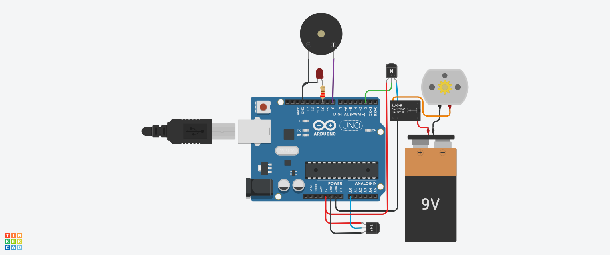

# DIO - Projeto Eletronico

 Este é o Projeto de Circuito Eletronico Desenvolvido para o Curso da Plataforma DIO 

Projeto de Circuitos Eletrônicos - IoT

Neste projeto, simulando uma estufa de hortaliças, deve ser desenvolvido no simulador TinkerCad (https://www.tinkercad.com/) um circuito eletrônico envolvendo um sensor de temperatura, uma buzina, um LED e um motor, controlados por meio de um Arduino. O projeto deve seguir a seguinte funcionalidade:

(a) Fazer a leitura da temperatura;

(b) Fazer o acionamento de um motor de ventilador caso a temperatura seja igual ou maior a 30 °C;

(c) Caso a temperatura ultrapasse os 50 °C, um LED vermelho e uma buzina devem acionar avisando uma situação de emergência.

Todo o processo descrito deve ser programado em linguagem C na placa de projetos Arduino.

Foi desenvolvido no TinkerCAD no link : https://www.tinkercad.com/things/b59RsxT12og-projeto-de-circuitos-eletronicos-iot?sharecode=KP5mi5Q6ADwc__tfrf0JzhxgYDVLobIxDSSOo4Uonlo

As ligações eletricas descrita na imagem abaixo e o programa do arduino se encontra para efetuar o DOWNLOAD.

